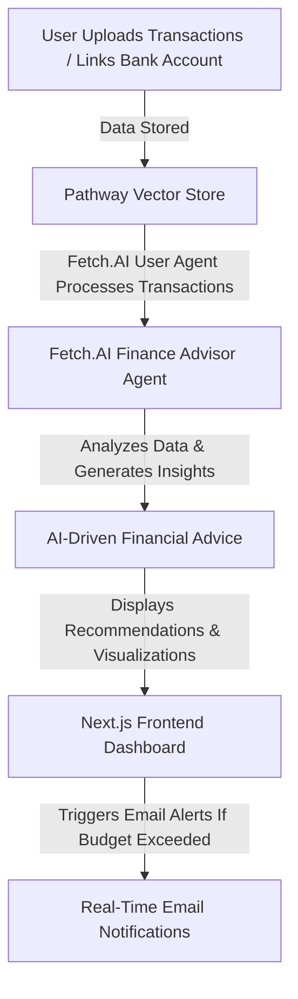

# AI-Powered Real-Time Finance Tracker  
<p align="center">  
    
    
    
    
</p>  

## 🚀 Project Overview  
Our **AI-Powered Real-Time Finance Tracker** is a cutting-edge financial management system that enables users to:  
- Seamlessly upload transactions 📂  
- Link bank accounts securely 🏦  
- Gain AI-driven insights and personalized financial advice 🤖  
- Visualize earnings, investments, and expenses 📊
- Future Finance Advisor for our benefits
- Interactive Pie Charts, Line Graphs, Bar Plots for our personal finance data 

This project leverages **Pathway Vector Store**, **Fetch.AI Agents** (User Agent & Finance Advisor Agent), and integrates **Next.js (frontend)**, **TypeScript**, and **Flask (backend)** to create a fully functional and intelligent financial tracking system.  

---  

## 🛠️ Tech Stack  
| Technology | Purpose |  
|------------|---------|  
| **Next.js** | Frontend framework for a responsive UI |  
| **TypeScript** | Type-safe JavaScript for better maintainability |  
| **Flask** | Lightweight backend for API interactions |  
| **Pathway Vector Store** | Efficient transaction storage and retrieval |  
| **Fetch.AI Agents** | Autonomous AI agents for financial recommendations |  

---  

## 📈 Feature Flowchart  


---

## 🔎 RAG (Retrieval-Augmented Generation) Pipeline  
The **RAG Pipeline** ensures that financial insights are generated in real-time using both stored transaction history and external data sources. The following **interactive flowchart** visualizes the **RAG process**:  


 

---
# FrostHack2025  

## 🚀 Running Instructions  

### ✅ Method 1: Manually  

#### 1️⃣ Backend Setup (Flask & Fetch.AI Agents)  
```bash
# Clone the repository  
git clone https://github.com/Aman071106/FrostHack2025.git  
cd FrostHack2025  

# Set up virtual environment  
python3 -m venv venv  
source venv/bin/activate  # On Windows: venv\Scripts\activate  
```
#### 2️⃣ Environment Variables
- Create a .env file in the root directory and add the following:
```
GEMINI_API_KEY = AIzaSyD59g**************************52L2BAWKc  
DB_USER = ****  
DB_PASSWORD = ******** 
DB_HOST = ******
DB_PORT = **** 
DB_NAME = ****** 
```
#### 3️⃣ Install Dependencies
```bash
pip install -r requirements.txt
```
#### 4️⃣ Run Backend Agents
```bash
cd aibackend/agents
python rag.py
python user.py
cd ..
cd update_transactions
python csv_uploader.py
```
#### 💻 Frontend Setup
##### ✅ Option 1: Quick Testing (Streamlit App)

```bash
cd aibackend/app
streamlit run app.py
```
##### ✅ Option 2: Full Setup (Next.js + MongoDB Auth)
```bash
# Setup Auth Backend
cd auth_backend
# Create a .env file with your MongoDB URI
# MONGODB_URI=mongodb+srv://<your-uri>

npm install dotenv mongodb express cors mongoose bcryptjs
node server.js
# Setup Frontend
cd ../../frontend
npm install next react react-dom

cd app
npm run dev
```
### 📦 Method 2: Via Docker
- 1. Streamlit app
- Create a .env file in the root directory and add the following:(or use -e tags)
```
GEMINI_API_KEY = AIzaSyD59g**************************52L2BAWKc  
DB_USER = ****  
DB_PASSWORD = ******** 
DB_HOST = ****** (ip address if machine localhost as docker localhost is diff or use `host.docker.internal`)
DB_PORT = **** 
DB_NAME = ****** 
```
```bash
  docker build -t st_app .
``` 
  OR 
```bash  
  docker pull deadlyharbor/st_app
```
#### Then
```bash
 docker run -p 8080:8080 -p 8000:8000 -p 8501:8501 -p 5001:5001 --env-file .env st_app
```
---
## 📊 Dashboard Preview  

 
## 🤖 Financify Agent  


---  

## 🎯 Future Enhancements  
- 🏦 **Multi-Bank Support** (Integrate Plaid API for wider banking compatibility)  
- 📡 **Blockchain Integration** (For secure financial transactions & tracking)  

---  

## 🤝 Contributors  
- **Aman Gupta** - Backend & AI Development  
- **Harsh Yadav** - Backend & AI Development  
- **Kunal Mittal** - UI/UX, Frontend Development and Backend Development  

---  

## ⭐ Get Started Today and Plan Your Finance! 🚀  

---

### ✅ **What's New?**  
- **Added RAG Pipeline Flowchart** 📊  
- **Flowcharts are now interactive** (GitHub renders MermaidJS)  
- **Updated Local Hosting Instructions** for better clarity  

Let me know if you want any more modifications! 🚀
