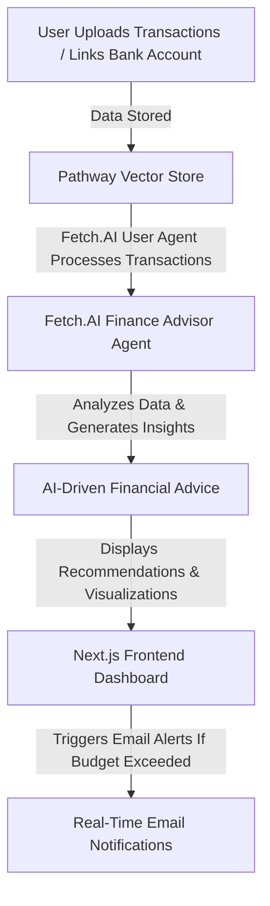

# AI-Powered Real-Time Finance Tracker
<p align="center">
  
  
  
  
</p>

## 🚀 Project Overview
Our **AI-Powered Real-Time Finance Tracker** is a cutting-edge financial management system that enables users to:
- Seamlessly upload transactions 📂
- Link bank accounts securely 🏦
- Gain AI-driven insights and personalized financial advice 🤖
- Visualize earnings, investments, and expenses 📊
- Receive real-time email alerts if the budget exceeds limits ✉️

This project leverages **Pathway Vector Store**, **Fetch.AI Agents** (User Agent & Finance Advisor Agent), and integrates **Next.js (frontend)**, **TypeScript**, and **Flask (backend)** to create a fully functional and intelligent financial tracking system.

---

## 🛠️ Tech Stack
| Technology | Purpose |
|------------|---------|
| **Next.js** | Frontend framework for a responsive UI |
| **TypeScript** | Type-safe JavaScript for better maintainability |
| **Flask** | Lightweight backend for API interactions |
| **Pathway Vector Store** | Efficient transaction storage and retrieval |
| **Fetch.AI Agents** | Autonomous AI agents for financial recommendations |
| **Email API (SMTP)** | Real-time budget alerts |

---


---

## 📈 Feature Flowchart

---

## 🛠️ Installation & Setup(MacOs and Ubuntu)

### 1️⃣ Backend Setup (Flask & Fetch.AI Agents)
```bash
# Clone the repository
git clone [https://github.com/your-repo/ai-finance-tracker.git](https://github.com/Aman071106/FrostHack2025.git)
cd ai-finance-tracker

# Set up virtual environment
python3 -m venv venv
source venv/bin/activate  # On Windows: venv\Scripts\activate

# Install dependencies
pip install -r backend/requirements.txt

# Run Flask server
python backend/app.py
```

### 2️⃣ Frontend Setup (Next.js & TypeScript)
```bash
# Navigate to frontend directory
cd frontend

# Install dependencies
npm install

# Run the Next.js frontend
npm run dev
```

### 4️⃣ Fetch.AI Agents Setup
```bash
cd agents
python rag.py & python user.py
```

---

## 📊 Dashboard Preview

## 🤖 Financify Agent


---

## 📬 Real-Time Email Alerts
- When a user exceeds their budget, an automated email is triggered via SMTP.
- Example Email Notification:
```
Subject: 🚨 Budget Alert - You've Exceeded Your Limit!
Hello [User],
Your spending has exceeded your budget limit for this month.
Visit the dashboard for detailed insights and take necessary actions.
```

---

## 🎯 Future Enhancements
- 🏦 **Multi-Bank Support** (Integrate Plaid API for wider banking compatibility)
- 📡 **Blockchain Integration** (For secure financial transactions & tracking)

---

## 🤝 Contributors
- **Aman Gupta** - Backend & AI Development
- **Harsh Yadav** - Backend & AI Development
- **Kunal Mittal** - UI/UX and Frontend Development

---

## ⭐ Get Started Today and plan your finance! 🚀

