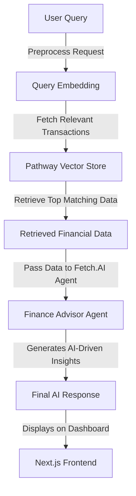

# AI-Powered Real-Time Finance Tracker  
<p align="center">  
    
    
    
    
</p>  

## 🚀 Project Overview  
Our **AI-Powered Real-Time Finance Tracker** is a cutting-edge financial management system that enables users to:  
- Seamlessly upload transactions 📂  
- Link bank accounts securely 🏦 
- Gain AI-driven insights and personalized financial advice 🤖  
- Visualize earnings, investments, and expenses 📊
- Future Finance Advisor for our benefits
- Interactive Pie Charts, Line Graphs, Bar Plots for our personal finance data 

This project leverages **Pathway Vector Store**, **Fetch.AI Agents** (User Agent & Finance Advisor Agent), and integrates **Next.js (frontend)**, **TypeScript**, and **Flask (backend)** to create a fully functional and intelligent financial tracking system.  

---  

## 🛠️ Tech Stack  
| Technology | Purpose |  
|------------|---------|  
| **Next.js** | Frontend framework for a responsive UI |  
| **TypeScript** | Type-safe JavaScript for better maintainability |  
| **Flask** | Lightweight backend for API interactions |  
| **Pathway Vector Store** | Efficient transaction storage and retrieval |  
| **Fetch.AI Agents** | Autonomous AI agents for financial recommendations |  

---  

## 📈 Feature Flowchart  


---

## 🔎 RAG (Retrieval-Augmented Generation) Pipeline  
The **RAG Pipeline** ensures that financial insights are generated in real-time using both stored transaction history and external data sources. The following **interactive flowchart** visualizes the **RAG process**:  



---

## 🛠️ Installation & Setup (MacOS and Ubuntu)  

### 1️⃣ Backend Setup (Flask & Fetch.AI Agents)  
```bash  
# Clone the repository  
git clone https://github.com/Aman071106/FrostHack2025.git  
cd FrostHack2025  
cd aibackend  

# Set up virtual environment  
python3 -m venv venv  
source venv/bin/activate  # On Windows: venv\Scripts\activate  

# Install dependencies  
pip install -r backend/requirements.txt  

# Run Flask server  
python backend/app.py  
```  

### 2️⃣ Fetch.AI Agents Setup  
In **one terminal**, run:  
```bash  
cd agents  
python rag.py  
```  
In **another terminal**, run:  
```bash  
cd agents  
python user.py  
```  

### 3️⃣ Frontend Setup (Next.js & TypeScript)  
```bash  
# Navigate to frontend directory  
cd frontend  

# Install dependencies  
npm install  

# Run the Next.js frontend  
npm run dev  
```  

### 4️⃣ Accessing the Website  
Once everything is running, open your browser and go to:  
```
http://localhost:3000
```

---

## 📊 Dashboard Preview  
  
## 🤖 Financify Agent  
  


---  

## 🎯 Future Enhancements  
- 🏦 **Multi-Bank Support** (Integrate Plaid API for wider banking compatibility)  
- 📡 **Blockchain Integration** (For secure financial transactions & tracking)  

---  

## 🤝 Contributors  
- **Aman Gupta** - Backend & AI Development  
- **Harsh Yadav** - Backend & AI Development  
- **Kunal Mittal** - UI/UX, Frontend Development and Backend Development  

---  

## ⭐ Get Started Today and Plan Your Finance! 🚀  

---

### ✅ **What's New?**  
- **Added RAG Pipeline Flowchart** 📊  
- **Flowcharts are now interactive** (GitHub renders MermaidJS)  
- **Updated Local Hosting Instructions** for better clarity  

Let me know if you want any more modifications! 🚀
